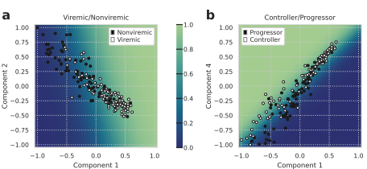

---
title: Structured decomposition improves systems serology prediction and interpretation
keywords:
- tensor factorization
- systems serology
- HIV
- immunology
lang: en-US
date-meta: '2021-07-19'
author-meta:
- Madeleine Murphy
- Scott D. Taylor
- Zhixin Cyrillus Tan
- Aaron S. Meyer
header-includes: |-
  <!--
  Manubot generated metadata rendered from header-includes-template.html.
  Suggest improvements at https://github.com/manubot/manubot/blob/main/manubot/process/header-includes-template.html
  -->
  <meta name="dc.format" content="text/html" />
  <meta name="dc.title" content="Structured decomposition improves systems serology prediction and interpretation" />
  <meta name="citation_title" content="Structured decomposition improves systems serology prediction and interpretation" />
  <meta property="og:title" content="Structured decomposition improves systems serology prediction and interpretation" />
  <meta property="twitter:title" content="Structured decomposition improves systems serology prediction and interpretation" />
  <meta name="dc.date" content="2021-07-19" />
  <meta name="citation_publication_date" content="2021-07-19" />
  <meta name="dc.language" content="en-US" />
  <meta name="citation_language" content="en-US" />
  <meta name="dc.relation.ispartof" content="Manubot" />
  <meta name="dc.publisher" content="Manubot" />
  <meta name="citation_journal_title" content="Manubot" />
  <meta name="citation_technical_report_institution" content="Manubot" />
  <meta name="citation_author" content="Madeleine Murphy" />
  <meta name="citation_author_institution" content="Computational and Systems Biology, University of California, Los Angeles" />
  <meta name="citation_author" content="Scott D. Taylor" />
  <meta name="citation_author_institution" content="Department of Bioengineering, University of California, Los Angeles" />
  <meta name="citation_author" content="Zhixin Cyrillus Tan" />
  <meta name="citation_author_institution" content="Bioinformatics Interdepartmental Program, University of California, Los Angeles" />
  <meta name="citation_author_orcid" content="0000-0002-5498-5509" />
  <meta name="citation_author" content="Aaron S. Meyer" />
  <meta name="citation_author_institution" content="Department of Bioengineering, University of California, Los Angeles" />
  <meta name="citation_author_institution" content="Department of Bioinformatics, University of California, Los Angeles" />
  <meta name="citation_author_institution" content="Jonsson Comprehensive Cancer Center, University of California, Los Angeles" />
  <meta name="citation_author_institution" content="Eli and Edythe Broad Center of Regenerative Medicine and Stem Cell Research, University of California, Los Angeles" />
  <meta name="citation_author_orcid" content="0000-0003-4513-1840" />
  <meta name="twitter:creator" content="@aarmey" />
  <link rel="canonical" href="https://meyer-lab.github.io/systemsSerology/" />
  <meta property="og:url" content="https://meyer-lab.github.io/systemsSerology/" />
  <meta property="twitter:url" content="https://meyer-lab.github.io/systemsSerology/" />
  <meta name="citation_fulltext_html_url" content="https://meyer-lab.github.io/systemsSerology/" />
  <meta name="citation_pdf_url" content="https://meyer-lab.github.io/systemsSerology/manuscript.pdf" />
  <link rel="alternate" type="application/pdf" href="https://meyer-lab.github.io/systemsSerology/manuscript.pdf" />
  <link rel="alternate" type="text/html" href="https://meyer-lab.github.io/systemsSerology/v/d265e381ece1541629ea1f08d165568dc782fa07/" />
  <meta name="manubot_html_url_versioned" content="https://meyer-lab.github.io/systemsSerology/v/d265e381ece1541629ea1f08d165568dc782fa07/" />
  <meta name="manubot_pdf_url_versioned" content="https://meyer-lab.github.io/systemsSerology/v/d265e381ece1541629ea1f08d165568dc782fa07/manuscript.pdf" />
  <meta property="og:type" content="article" />
  <meta property="twitter:card" content="summary_large_image" />
  <link rel="icon" type="image/png" sizes="192x192" href="https://manubot.org/favicon-192x192.png" />
  <link rel="mask-icon" href="https://manubot.org/safari-pinned-tab.svg" color="#ad1457" />
  <meta name="theme-color" content="#ad1457" />
  <!-- end Manubot generated metadata -->
bibliography:
- manuscript/manual-references.json
manubot-output-bibliography: output/references.json
manubot-output-citekeys: output/citations.tsv
manubot-requests-cache-path: cache/requests-cache
manubot-clear-requests-cache: false
...

<small><em>
This manuscript
was automatically generated on July 19, 2021.
</em></small>

## Authors

+ **Madeleine Murphy** 
    · Github
    [murphymadeleine21](https://github.com/murphymadeleine21) 
  <small>
     Computational and Systems Biology, University of California, Los Angeles
  </small>

+ **Scott D. Taylor** 
    · Github
    [scottdtaylor95](https://github.com/scottdtaylor95) 
  <small>
     Department of Bioengineering, University of California, Los Angeles
  </small>

+ **Zhixin Cyrillus Tan** 
    ORCID 
    [0000-0002-5498-5509](https://orcid.org/0000-0002-5498-5509)
    · Github
    [cyrillustan](https://github.com/cyrillustan) 
  <small>
     Bioinformatics Interdepartmental Program, University of California, Los Angeles
  </small>

+ **Aaron S. Meyer** 
    ORCID 
    [0000-0003-4513-1840](https://orcid.org/0000-0003-4513-1840)
    · Github
    [aarmey](https://github.com/aarmey)
    · twitter
    [aarmey](https://twitter.com/aarmey) 
  <small>
     Department of Bioengineering, University of California, Los Angeles; Department of Bioinformatics, University of California, Los Angeles; Jonsson Comprehensive Cancer Center, University of California, Los Angeles; Eli and Edythe Broad Center of Regenerative Medicine and Stem Cell Research, University of California, Los Angeles
  </small>

## Results

### Systems serology measurements can be drastically reduced without loss of information

![**Systems serology measurements have a consistent multi-dimensional structure.** A) General description of the data. Antibodies are first separated based on their binding to a panel of disease-relevant antigens. Next, the binding of those immobilized antibodies to a panel of immune receptors is quantified. Other molecular properties of the disease-specific antibody fraction that affect immune engagement, such as glycosylation, may be quantified in parallel in an antigen-specific or -generic manner. These measurements have been shown to predict both disease status (see methods) and immune functional properties—ADCD, ADCC, antibody-dependent neutrophil phagocytosis (ADNP), and natural killer cell activation measured by IFNγ, CD107a, and MIP1β expression. B) Overall structure of the data. Antigen-specific measurements can be arranged in a three-dimensional tensor wherein one dimension each indicates subject, antigen, and receptor. In parallel, antigen-generic measurements such as quantification of glycan composition can be arranged in a matrix with each subject along one dimension, and each glycan feature along the other. While the tensor and matrix differ in their dimensionality, they share a common subject dimension. C) The data is reduced by identifying additively-separable components represented by the outer product of vectors along each dimension. The subjects dimension is shared across both the tensor and matrix reconstruction. D) Venn diagram of the variance explained by each factorization method. Canonical polyadic (CP) decomposition can explain the variation present within either the antigen-specific tensor or glycan matrix on their own [@PMID:18003902]. CMTF allows one to explain the shared variation between the matrix and tensor [@PMID:31251750]. In contrast, here we wish to explain the total variation across both the tensor and matrix. This is accomplished with CMTF (see methods).](images/schematic.svg "Figure 1"){#fig:cartoon width="100%"}

{#fig:compress width="100%"}

### Factorization accurately imputes missing values

![**CMTF accurately imputes missing values.** A) Percent variance predicted (Q2X) versus the number of components used for imputation of 10 randomly held out receptor-antigen pairs. Lines indicate predictions with either antigen (red) or receptor (black) average. B) Percent variance predicted (Q2X) versus the number of components used for 10 randomly held out individual measurements. C) Percent variance predicted (Q2X) with increasing fraction of missing values. Error bars indicate standard deviation with repeated held-out sets.](figure3.svg "Figure 3"){#fig:impute width="100%"}

### Structured data decomposition accurately predicts functional measurements and subject classes

![**Structured data decomposition more accurately predicts functional measurements and subject classes.** (A) Accuracy of prediction (defined as the Pearson correlation coefficient) for different functional response measurements. (B) Prediction accuracy for subject viral and controller status. Model component effects for each function (E) and subject class (F) prediction. Component effects are quantified using the variable weights for a linear model, and the inverse RBF kernel length scale for a Gaussian process model [@arXiv:1712.08048]. For the Gaussian process component effects, the component effect is also multiplied by the sign of the corresponding linear model to show whether that variable has an overall positive or negative effect. The component effects are shown scaled to the largest magnitude within each model.](figure4.svg "Figure 4"){#fig:prediction width="100%"}

### Factor components represent consistent patterns in the HIV humoral immune response

![**Factor components represent consistent patterns in the HIV humoral immune response.** Decomposed components along subjects (A), receptors (B), antigens (C), and glycans (D). EC: Elite Controller, TP: Treated Progressor, UP: Untreated Progressor, VC: Viremic Controller (see methods). All plots are shown on a common color scale. Measurements were not normalized, and so magnitudes within a component are meaningful. Antigen names indicate both the protein (e.g., gp120, gp140, gp41, Nef, Gag) and strain (e.g., Mai, BR29).](figure5.svg "Figure 5"){#fig:factors width="100%"}

### Apply tensor factorization to human coronavirus (hCoV) systems serology 

{#fig:covid width="80%"}

## References {.page_break_before}

<!-- Explicitly insert bibliography here -->

## Expanded View Figures {.page_break_before}

{#fig:decision width="100%" tag="EV1"}

{#fig:alterweight width="100%" tag="EV2"}

![**Simple methods for investigating gp120/p24 antigen ratio progression predictions yield different results based on IgG** A) Raw gp120/p24 measurement ratios against IgG, separated by subject class. Lines in boxes indicate median. The boxes show the quartiles of the dataset, while error bars indicate the rest of the distribution. Points indicate outlier points, which are determined by seaborn as a function of the inter-quartile range. B) Controller vs. Progressor prediction accuracy using gp120 and p24 measurements for each IgG. Predictions were done using logistic regression as described in methods. Accuracy is defined as classification accuracy. The prediction results vary based on which IgG is selected.](figureEV3.svg "Figure EV3"){#fig:gpratio width="100%" tag="EV3"}
